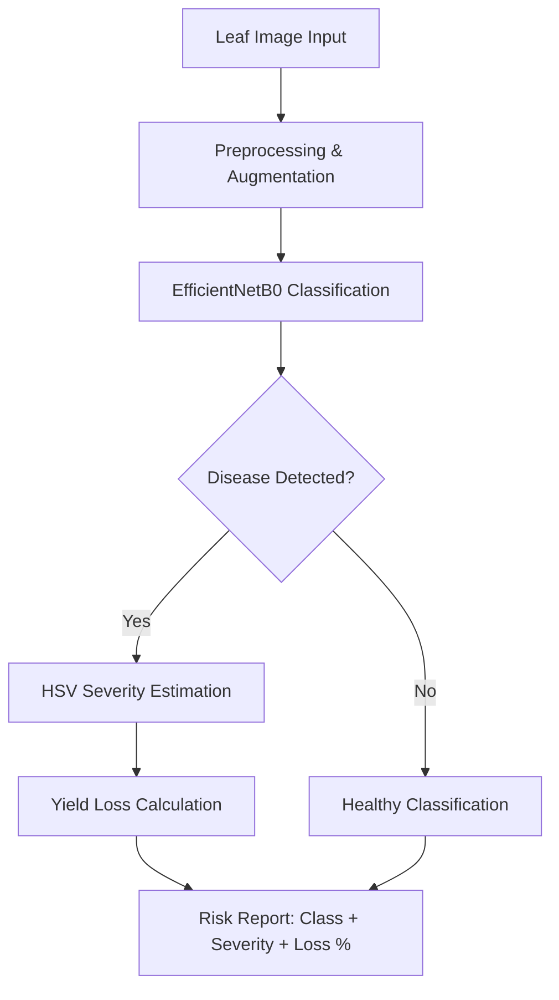

# 🌱 Crop Risk Detection and Yield Prediction

> A deep learning–based system for crop disease detection, severity estimation, and yield loss prediction using plant leaf images.

---

## 📖 Overview

Crop diseases significantly reduce agricultural productivity worldwide. This project provides an AI-powered pipeline that:

- **Detects crop diseases** from leaf images using transfer learning
- **Estimates disease severity** via computer vision techniques
- **Predicts yield loss** based on detected disease severity
- **Assists farmers** with early warning and risk assessment

---

## 🏗 Pipeline



---

## 🧠 Methodology

### 1. Disease Classification (Transfer Learning)
- **Base Model:** EfficientNetB0 pre-trained on ImageNet
- **Strategy:** Two-stage fine-tuning
  - Stage 1: Freeze backbone, train classification head (lr=1e-4)
  - Stage 2: Unfreeze top 40 layers, fine-tune (lr=1e-5)
- **Augmentation:** Rotation, zoom, shift, brightness, shear, flip
- **Class Balancing:** Computed class weights to handle imbalance
- **Regularization:** Dropout (0.4), EarlyStopping, ModelCheckpoint

### 2. Severity Estimation (Computer Vision)
- **Technique:** HSV color space analysis
- **Method:** 
  - Isolate leaf region using green HSV mask
  - Detect disease spots (yellow/brown) within leaf mask
  - Calculate infection ratio: `(disease pixels / leaf pixels) × 100`
- **Severity Levels:**
  - `< 10%` — Mild
  - `10-30%` — Moderate
  - `30-60%` — Severe
  - `> 60%` — Critical

### 3. Yield Loss Prediction
- **Approach:** Heuristic crop-specific factors multiplied by severity
- **Crop Factors:** Tomato (0.45), Potato (0.55), Pepper (0.40)
- **Formula:** `Yield Loss (%) = Severity (%) × Crop Factor`

---

## 📊 Dataset

| Crop | Source | Classes |
|------|--------|---------|
| Pepper | PlantVillage | Healthy, Bacterial Spot, etc. |
| Potato | PlantVillage | Healthy, Early Blight, Late Blight |
| Tomato | PlantVillage | Healthy, Bacterial Spot, Late Blight, etc. |

**Split:** 80% Training / 20% Validation (stratified by disease class)

---

## 🛠 Tech Stack

| Category | Tools |
|----------|-------|
| **Language** | Python 3.x |
| **Deep Learning** | TensorFlow / Keras |
| **Computer Vision** | OpenCV |
| **Data Processing** | NumPy, Scikit-learn |
| **Visualization** | Matplotlib, Seaborn |
| **Environment** | Google Colab / Jupyter |

---

## 📂 Project Structure

```
crop-risk-detection/
├── data/
│   ├── Pepper.zip
│   ├── Potato.zip
│   └── Tomato.zip
├── models/
│   └── crop_disease_model.keras
├── notebooks/
│   └── crop_risk_detection_and_yield_prediction.ipynb
├── results/
│   ├── accuracy_plot.png
│   ├── confusion_matrix.png
│   └── classification_report.txt
├── requirements.txt
└── README.md
```

---

## 🚀 Getting Started

### Prerequisites
```bash
pip install -r requirements.txt
```

### Requirements
```
tensorflow>=2.10
opencv-python
scikit-learn
numpy
matplotlib
seaborn
pillow
```

### Training
```python
# Mount Drive (Colab) or set local paths
from google.colab import drive
drive.mount('/content/drive')

# Run notebook cells sequentially:
# 1. Extract datasets
# 2. Train/validation split
# 3. Train model (transfer learning)
# 4. Fine-tune model
# 5. Evaluate & save
```

### Inference
```python
from tensorflow.keras.preprocessing import image
import numpy as np

img = image.load_img("leaf.jpg", target_size=(224, 224))
img_array = preprocess_input(np.expand_dims(image.img_to_array(img), axis=0))
prediction = model.predict(img_array)
class_name = class_names[np.argmax(prediction)]
```

---

## 📈 Results

| Metric | Value |
|--------|-------|
| Input Resolution | 224×224 |
| Batch Size | 32 |
| Optimizer | Adam (lr=1e-4 → 1e-5) |
| Loss Function | Categorical Crossentropy |
| Validation Strategy | 20% holdout |

> Detailed accuracy/loss curves and confusion matrix available in `/results/`

---

## 💡 Applications

- **Precision Agriculture:** Targeted pesticide application
- **Smart Farming:** Automated crop health monitoring
- **Early Warning Systems:** Disease outbreak detection
- **Decision Support:** Yield loss forecasting for insurance/finance

---

## 🔮 Future Improvements

- [ ] Integrate U-Net / DeepLabV3+ for leaf segmentation
- [ ] Replace heuristic severity with learned regression model
- [ ] Deploy as FastAPI / Flask web service
- [ ] Mobile app with TensorFlow Lite
- [ ] Expand to 20+ crop varieties
- [ ] Add Grad-CAM explainability for disease localization
- [ ] Incorporate weather/soil data for yield prediction

---

## 👨‍💻 Author

**Harsha Vardhan Appikatla**

- GitHub: [@HarshaAppikatla](https://github.com/HarshaAppikatla)
- LinkedIn: [appikatlaharshavardhan](https://www.linkedin.com/in/appikatlaharshavardhan/)

---

## 📜 License

MIT License — feel free to use and modify for research or commercial purposes.
