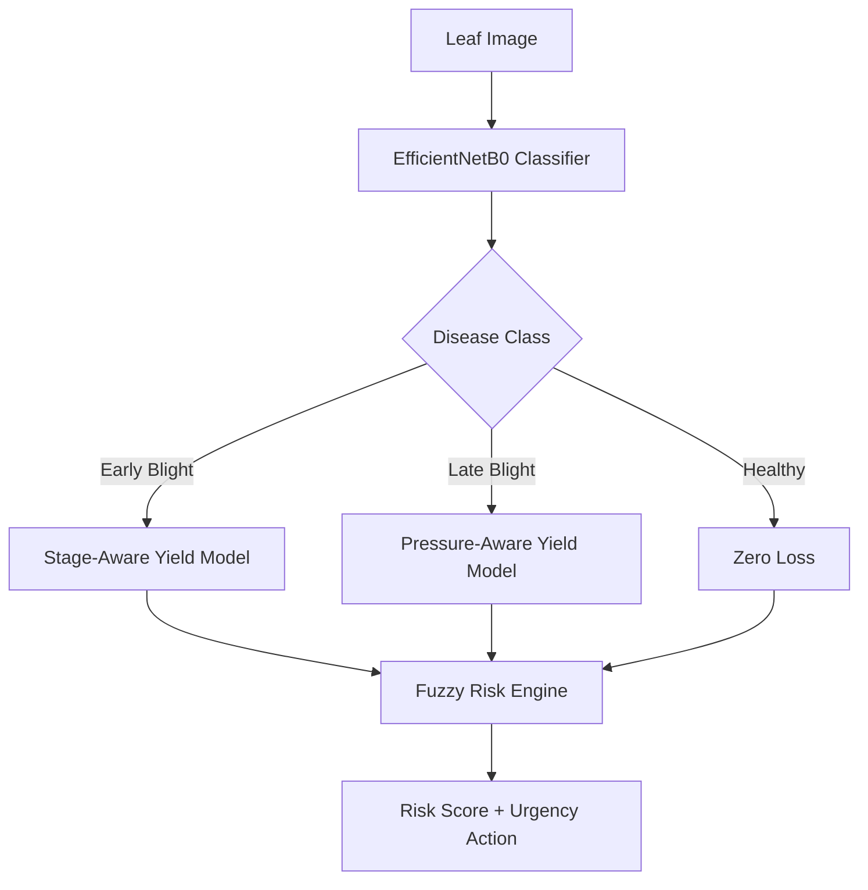

# 🌱 Potato Disease Detection & Risk Assessment

> A deep learning–powered pipeline for potato leaf disease classification, severity estimation, yield loss prediction, and fuzzy risk assessment.

---

## 📖 Overview

Potato diseases like **Early Blight** and **Late Blight** cause significant yield loss globally. This project builds an end-to-end AI system that:

- **Classifies** potato leaf diseases using transfer learning
- **Estimates severity** via advanced digital image processing
- **Predicts yield loss** using agronomic coefficients and disease pressure models
- **Assesses farm-level risk** using fuzzy logic inference

---

## 🏗 System Architecture



---

## 🧠 Methodology

### 1. Disease Classification
- **Architecture:** EfficientNetB0 (ImageNet pre-trained)
- **Strategy:** Two-stage fine-tuning
  - Phase 1: Freeze backbone, train head (`lr=1e-4`, 50 epochs)
  - Phase 2: Unfreeze top 60 layers, fine-tune (`lr=1e-5`, 15 epochs)
- **Augmentation:** Flip, brightness, contrast, rotation
- **Regularization:** BatchNorm, Dropout (0.3), EarlyStopping, ReduceLROnPlateau
- **Class Balancing:** `compute_class_weight="balanced"`

### 2. Severity Estimation (DIP Pipeline)
- **Leaf Segmentation:** Multi-range HSV masking (green, yellow-green, brown, red-brown, dark green) + Canny edge refinement
- **Lesion Detection:** 6 targeted HSV ranges for necrotic/dried tissue
- **Post-processing:** Connected component filtering, hole filling, morphological closing
- **Output:** `severity_pct = (lesion_pixels / leaf_pixels) × 100`

### 3. Yield Loss Prediction
- **Disease-specific coefficients** based on crop growth stage:
  - Early Blight: 0.19–0.32 pp loss per 1% severity
  - Late Blight: 0.50–0.70 pp loss per 1% severity
- **Disease pressure multipliers:** Low (0.75), Normal (1.0), Favorable (1.15), Epidemic (1.35)
- **Loss caps:** Prevents unrealistic estimates (e.g., Late Blight capped at 50–100%)

### 4. Fuzzy Risk Assessment
- **Framework:** `scikit-fuzzy` Mamdani system
- **Inputs:** Severity (%), Yield Loss (%)
- **Outputs:** Risk Score (0–100), Urgency Level
- **Rules:** 10 fuzzy rules mapping disease impact to action urgency
- **Urgency levels:** Monitor Weekly → Apply Fungicide Soon → Act Within 48 Hours → Immediate Action

---

## 📊 Dataset

| Attribute | Details |
|:----------|:--------|
| **Crop** | 🥔 Potato |
| **Source** | PlantVillage Dataset |
| **Classes** | Early Blight, Late Blight, Healthy |
| **Split** | 64% Train / 16% Validation / 20% Test (stratified) |
| **Preprocessing** | Resize to 224×224, EfficientNet normalization |

---

## 🛠 Tech Stack

| Category | Tools |
|:---------|:------|
| **Language** | Python 3.x |
| **Deep Learning** | TensorFlow / Keras, EfficientNetB0 |
| **Computer Vision** | OpenCV (HSV, Canny, Morphology) |
| **Fuzzy Logic** | scikit-fuzzy |
| **Data Processing** | NumPy, Pandas, Scikit-learn |
| **Visualization** | Matplotlib, Seaborn |
| **Environment** | Google Colab / Jupyter |

---

## 📂 Project Structure

```
potato-disease-risk/
├── data/
│   └── Potato.zip
├── notebooks/
│   └── potato_disease_22nd_april.ipynb
├── models/
│   ├── best_potato_disease_cnn.keras
│   ├── best_potato_disease_cnn_finetuned.keras
│   ├── potato_disease_cnn_final.keras
│   └── potato_class_names.json
├── results/
│   ├── batch_severity_results.csv
│   ├── batch_risk_results.csv
│   ├── training_curves.png
│   ├── confusion_matrix.png
│   └── sample_predictions.png
├── requirements.txt
└── README.md
```

---

## 🚀 Getting Started

### Prerequisites
```bash
pip install -r requirements.txt
```

### Requirements
```
tensorflow>=2.10
opencv-python
scikit-learn
scikit-fuzzy
numpy
pandas
matplotlib
seaborn
pillow
```

### Training Pipeline
```python
# 1. Mount Drive (Colab) or set local paths
# 2. Extract and validate dataset
# 3. Build stratified train/val/test splits
# 4. Stage 1: Train classification head
# 5. Stage 2: Fine-tune top 60 layers
# 6. Evaluate on held-out test set
# 7. Run batch severity + risk assessment
```

### Inference
```python
result = predict_disease_and_severity(
    "leaf.jpg",
    crop_stage="late_bulking_maturation",
    disease_pressure="favorable",
    expected_yield_t_ha=25.0
)

print(f"Disease: {result['disease']}")
print(f"Severity: {result['severity_pct']}%")
print(f"Yield Loss: {result['yield_loss_pct']}%")
print(f"Risk Score: {result['risk_score']}/100 — {result['urgency']}")
```

---

## 📈 Results

| Metric | Value |
|:-------|:------|
| **Input Resolution** | 224×224 |
| **Batch Size** | 32 |
| **Optimizer** | Adam (`1e-4` → `1e-5`) |
| **Validation Strategy** | Stratified 80/20 holdout |
| **Class Weights** | Balanced sampling |
| **Reproducibility** | `SEED=42` (Python, NumPy, TensorFlow) |

> Evaluation includes per-class precision/recall/F1, confusion matrix, and sample predictions with confidence scores.

---

## 💡 Applications

- **Precision Agriculture:** Targeted fungicide application based on disease stage
- **Smart Farming:** Automated field scouting and early warning systems
- **Decision Support:** Risk scores guide farm management actions
- **Insurance & Finance:** Objective yield loss estimation for claims

---

## 🔮 Future Improvements

- [ ] Multi-crop support (Pepper, Tomato)
- [ ] Replace heuristic DIP with U-Net segmentation
- [ ] Time-series severity tracking (AUDPC) for better yield models
- [ ] Deploy as REST API (FastAPI) or mobile app
- [ ] Integrate weather/soil IoT data
- [ ] Grad-CAM explainability for disease localization

---

## 👨‍💻 Author

**Harsha Vardhan Appikatla**

- GitHub: [@HarshaAppikatla](https://github.com/HarshaAppikatla)
- LinkedIn: [appikatlaharshavardhan](https://www.linkedin.com/in/appikatlaharshavardhan/)

---

## 📜 License

MIT License — free for research and commercial use.
