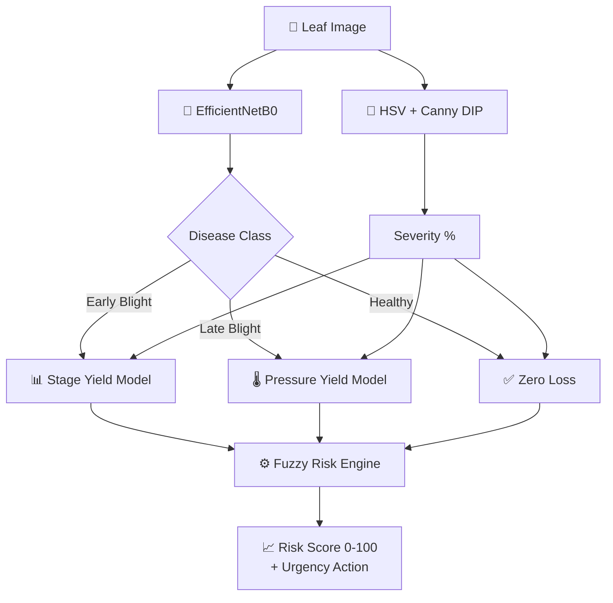
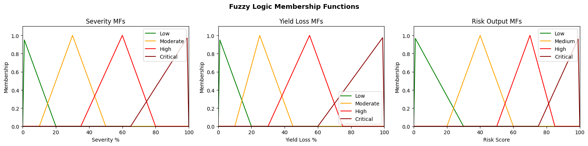
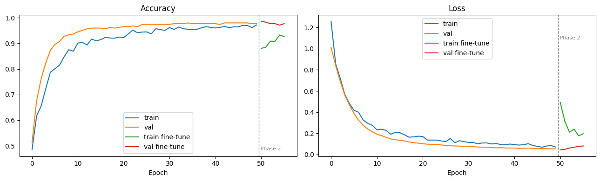
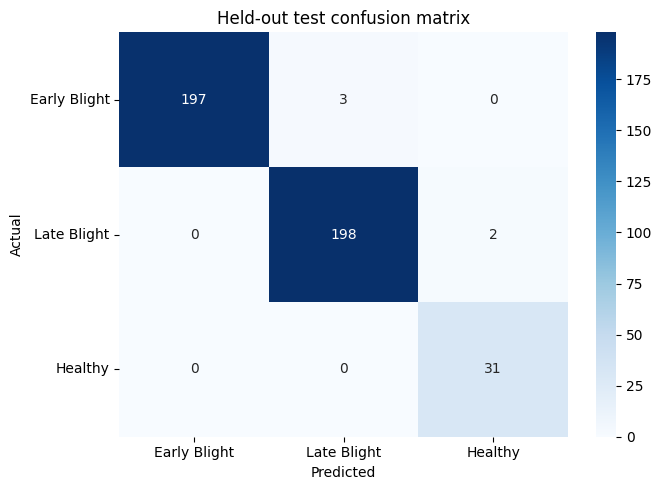
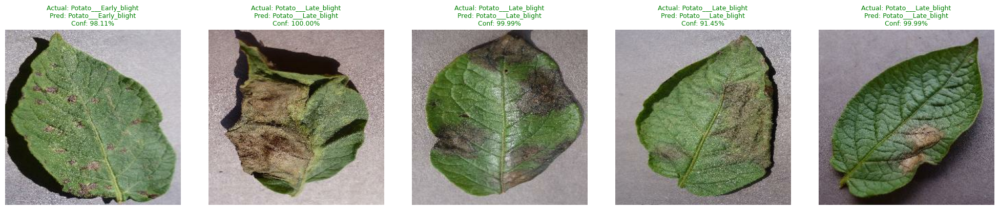
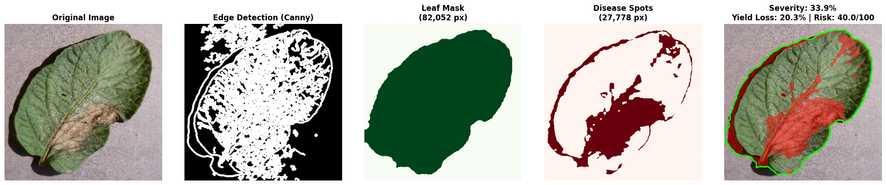
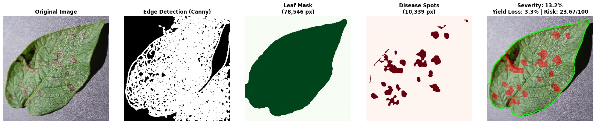
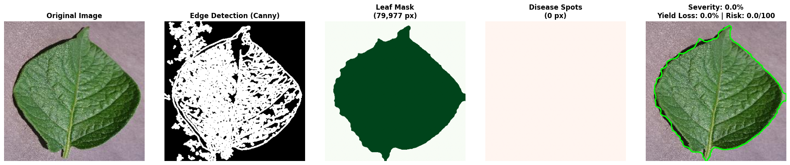
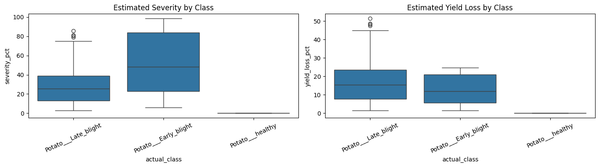
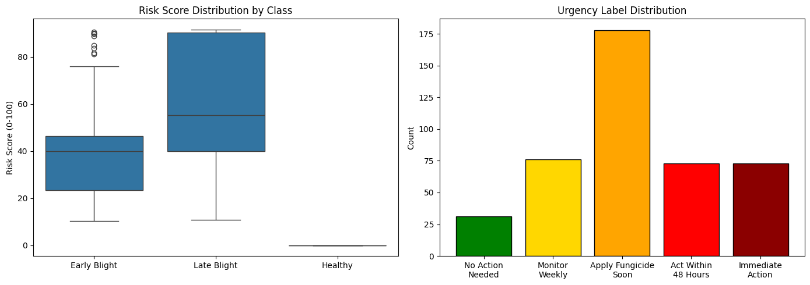

<div align="center">

# 🌱 Potato Disease Detection & Risk Assessment

**From a leaf photo to a farm-ready decision: disease, severity, yield loss and urgency.**


</div>

An end-to-end pipeline that takes one potato leaf image and answers four questions:

1. **What disease is it?** Early Blight, Late Blight or Healthy
2. **How bad is it?** % of leaf area damaged
3. **How much yield could be lost?** % of expected harvest (and t/ha if you give an expected yield)
4. **How urgently should the farmer act?** A 0–100 risk score with a recommended action

**Contents:** [Why](#-why-this-project) · [How it works](#-how-it-works) · [Methodology](#-methodology) · [Dataset](#-dataset) · [Results](#-results) · [Getting started](#-getting-started) · [Limitations](#-limitations) · [Glossary](#-glossary)

---

## ❓ Why This Project

**Early Blight** and **Late Blight** are two of the most damaging potato diseases worldwide. Farmers usually spot them by eye, which is slow and subjective, and late detection means lost yield. A disease name alone is also not enough: a farmer needs to know *how severe* it is and *what to do next*.

This project goes from **image → disease → severity → yield loss → action**.

---

## 🏗 How It Works



| Step | Module | Input | Output |
|:-----|:-------|:------|:-------|
| 1 | CNN classifier | Leaf image | Disease + confidence (flagged if below 70%) |
| 2 | Severity estimation (image processing) | Leaf image | Severity % + level |
| 3 | Yield loss model | Disease, severity, crop stage, disease pressure | Yield loss % (+ t/ha) |
| 4 | Fuzzy risk engine | Severity %, yield loss % | Risk score + urgency |

---

## 🧠 Methodology

### 1. Disease Classification
Uses **transfer learning**: EfficientNetB0 (pre-trained on ImageNet) is adapted to potato leaves instead of being trained from scratch.

- **Head:** GlobalAveragePooling → BatchNorm → Dropout(0.3) → Dense(3, softmax)
- **Model size:** 4.06M parameters; only 6,403 are trainable in Phase 1
- **Two-stage training**

  | Phase | What is trained | Learning rate | Epochs |
  |:--|:--|:--:|:--:|
  | 1 | Classification head only (backbone frozen) | 1e-4 | up to 50 |
  | 2 | Top 60 backbone layers + head | 1e-5 | up to 15 (stopped after 6 by EarlyStopping) |

- **Augmentation:** random horizontal flip, brightness (±0.2), contrast (0.8–1.2), random 90° rotations
- **Callbacks:** EarlyStopping (val loss, patience 5, restores best weights), ModelCheckpoint (best val accuracy), ReduceLROnPlateau (×0.5, patience 3)
- **Class balancing:** `compute_class_weight("balanced")` gives Healthy a weight of about 4.73 versus about 0.72 for the blight classes

### 2. Severity Estimation (Digital Image Processing)
Measures how much of the leaf is damaged. No extra labels or training are needed.

1. **Resize** to 384×384
2. **Segment the leaf:** 5 HSV colour ranges (green, yellow-green, yellow-brown, dark green, red-brown), minus pink and grey/white backgrounds, refined with Canny edges (used only inside the colour mask)
3. **Clean the mask:** morphological closing, hole filling, opening, keep the largest connected component
4. **Detect lesions:** Gaussian blur, then 6 colour rules for brown, dried or necrotic tissue, minus healthy green pixels; small blobs are removed
5. **Compute:** `severity_pct = lesion_pixels / leaf_pixels × 100`

Safeguards: healthy predictions get an empty lesion mask, and if less than 5% of the image is detected as leaf, the detection is flagged invalid instead of producing a misleading number.

| Severity | < 1% | 1–10% | 10–25% | 25–50% | ≥ 50% |
|:--|:--:|:--:|:--:|:--:|:--:|
| Level | None/trace | Mild | Moderate | Severe | Critical |

### 3. Yield Loss Prediction
Converts severity into an expected harvest loss:

```
Early Blight: yield_loss = severity × stage_coefficient                      (cap 40%)
Late Blight : yield_loss = severity × stage_coefficient × pressure_multiplier (cap by pressure)
```

Coefficients are percentage points (pp) of yield lost per 1% severity:

| Crop stage | Early Blight | Late Blight |
|:--|:--:|:--:|
| Tuber initiation / early bulking | 0.32 | 0.70 |
| Late bulking / maturation | 0.19 | 0.50 |
| Unknown (default) | 0.25 | 0.60 |

Late Blight only, by disease pressure (how favourable the conditions are for spread):

| Pressure | Low | Normal | Favorable | Epidemic |
|:--|:--:|:--:|:--:|:--:|
| Multiplier | 0.75 | 1.00 | 1.15 | 1.35 |
| Max loss cap | 50% | 70% | 85% | 100% |

**Example:** Late Blight, 33.85% severity, unknown stage, normal pressure → `33.85 × 0.60 = 20.31%` loss (level: High). If you pass `expected_yield_t_ha`, the loss is also reported in tonnes per hectare.

Yield-loss levels: < 5% Low · 5–15% Moderate · 15–30% High · ≥ 30% Very high.

### 4. Fuzzy Risk Assessment
Fuzzy logic handles "in-between" cases better than hard thresholds (24% vs 26% severity should not flip the advice abruptly).

- **Framework:** `scikit-fuzzy` Mamdani system (centroid defuzzification)
- **Inputs:** severity (%) and yield loss (%), each with 4 triangular sets: low, moderate, high, critical
- **Output:** risk score 0–100 with 4 sets: low, medium, high, critical
- **Healthy leaves** skip the fuzzy step and get risk 0

| Risk score | Urgency |
|:--:|:--|
| 0 (healthy) | ✅ No Action Needed |
| < 25 | 🟢 Monitor Weekly |
| 25 – 50 | 🟡 Apply Fungicide Soon |
| 50 – 75 | 🟠 Act Within 48 Hours |
| ≥ 75 | 🔴 Immediate Action Required |

<details>
<summary><b>The 10 fuzzy rules</b></summary>

| # | Severity | Yield loss | → Risk |
|:-:|:--|:--|:--|
| 1 | Low | Low | Low |
| 2 | Low | Moderate | Medium |
| 3 | Moderate | Low | Medium |
| 4 | Moderate | Moderate | Medium |
| 5 | Moderate | High | High |
| 6 | High | Moderate | High |
| 7 | High | High | Critical |
| 8 | Critical | any | Critical |
| 9 | any | Critical | Critical |
| 10 | Low | High | Medium |

</details>



---

## 📊 Dataset

| Attribute | Details |
|:----------|:--------|
| **Crop** | 🥔 Potato |
| **Source** | PlantVillage (potato subset) |
| **Total images** | 2,152 |
| **Classes** | Early Blight (1,000) · Late Blight (1,000) · Healthy (152) |
| **Preprocessing** | Resize to 224×224, EfficientNet preprocessing |

Stratified split (`SEED=42`): 80% train+val / 20% test, then 20% of train+val held out for validation.

| Split | Total | Early Blight | Late Blight | Healthy |
|:--|:--:|:--:|:--:|:--:|
| Train (64%) | 1,376 | 639 | 640 | 97 |
| Validation (16%) | 345 | 161 | 160 | 24 |
| Test (20%) | 431 | 200 | 200 | 31 |

---

## 📈 Results

### Classification (held-out test set, 431 images)

**Accuracy: 98.8% (426 / 431 correct) · Macro F1: 0.98**

| Class | Precision | Recall | F1 | Support |
|:------|:--:|:--:|:--:|:--:|
| Early Blight | 1.00 | 0.98 | 0.99 | 200 |
| Late Blight | 0.99 | 0.99 | 0.99 | 200 |
| Healthy | 0.94 | 1.00 | 0.97 | 31 |

Only 5 mistakes: 3 Early Blight predicted as Late Blight, and 2 Late Blight predicted as Healthy.

| Training curves | Confusion matrix |
|:--:|:--:|
|  |  |



### End-to-end examples
Each panel shows: original → Canny edges → leaf mask → lesion mask → overlay with severity, yield loss and risk.

| Leaf | Confidence | Severity | Yield loss | Risk | Action |
|:--|:--:|:--:|:--:|:--:|:--|
| Early Blight | 99.22% | 13.16% (Moderate) | 3.29% (Low) | 23.67 | 🟢 Monitor Weekly |
| Late Blight | 99.99% | 33.85% (Severe) | 20.31% (High) | 40.0 | 🟡 Apply Fungicide Soon |
| Healthy | 99.47% | 0% | 0% | 0 | ✅ No Action Needed |



<details>
<summary><b>More examples (Early Blight, Healthy)</b></summary>





</details>

### Batch severity, yield loss and risk (test set)
Run with crop stage = unknown, pressure = normal, and the **true** class label (not the model's prediction).

| Class | Mean severity | Median severity | Mean yield loss | Max yield loss |
|:--|:--:|:--:|:--:|:--:|
| Early Blight | 51.5% | 48.1% | 12.9% | 24.6% |
| Late Blight | 28.3% | 25.7% | 17.0% | 51.3% |
| Healthy | 0% | 0% | 0% | 0% |

| Urgency | Leaves |
|:--|:--:|
| ✅ No Action Needed | 31 |
| 🟢 Monitor Weekly | 76 |
| 🟡 Apply Fungicide Soon | 178 |
| 🟠 Act Within 48 Hours | 73 |
| 🔴 Immediate Action Required | 73 |

| Severity boxplots | Risk distribution |
|:--:|:--:|
|  |  |

---

## 🛠 Tech Stack

| Category | Tools |
|:---------|:------|
| **Language** | Python 3.x |
| **Deep Learning** | TensorFlow 2.19 / Keras, EfficientNetB0 |
| **Computer Vision** | OpenCV (HSV, Canny, morphology, connected components) |
| **Fuzzy Logic** | scikit-fuzzy |
| **Data & Metrics** | NumPy, Pandas, scikit-learn |
| **Visualization** | Matplotlib, Seaborn |
| **Environment** | Google Colab / Jupyter |

---

## 📂 Project Structure

```
potato-disease-risk/
├── data/
│   └── Potato.zip                        # PlantVillage potato subset (not committed)
├── notebooks/
│   └── potato_disease_22nd_april.ipynb   # Full pipeline: train → evaluate → severity → risk
├── models/
│   ├── best_potato_disease_cnn.keras             # Best checkpoint after Phase 1
│   ├── best_potato_disease_cnn_finetuned.keras   # Best checkpoint after Phase 2
│   ├── potato_disease_cnn_final.keras            # Final model
│   └── potato_class_names.json                   # Class index → name
├── results/
│   ├── batch_severity_results.csv
│   ├── batch_risk_results.csv
│   └── *.png                                     # Plots shown in this README
├── requirements.txt
└── README.md
```

---

## 🚀 Getting Started

### 1. Install
```bash
pip install -r requirements.txt
```

`requirements.txt`:
```
tensorflow>=2.10
opencv-python
scikit-learn
scikit-fuzzy
numpy
pandas
matplotlib
seaborn
```
The notebook was run on TensorFlow 2.19.0 in Google Colab.

### 2. Prepare the data
Download the PlantVillage potato images and zip them as `Potato.zip`. It must contain three folders:
`Potato___Early_blight`, `Potato___Late_blight`, `Potato___healthy`.

In Colab, put the zip in Google Drive (`MyDrive/Potato.zip`). Models and CSVs are saved to `MyDrive/Potato_artifacts/`. To run locally, change `ZIP_PATH`, `EXTRACT_PATH` and `ARTIFACT_DIR` in the notebook.

### 3. Run the notebook top to bottom
1. Extract and validate the dataset
2. Build stratified train / val / test splits
3. Phase 1: train the classification head
4. Phase 2: fine-tune the top 60 layers
5. Evaluate on the test set
6. Severity, yield loss and fuzzy risk for the whole test set (saves the CSVs)
7. Run the last cell so `predict_disease_and_severity` includes the risk step

### 4. Predict on a single leaf
```python
result = predict_disease_and_severity(
    "leaf.jpg",
    crop_stage="late_bulking_maturation",   # tuber_initiation_early_bulking | late_bulking_maturation | unknown
    disease_pressure="favorable",           # low | normal | favorable | epidemic
    expected_yield_t_ha=25.0,               # optional
)

print(f"Disease: {result['disease']} ({result['confidence']:.2%})")
print(f"Severity: {result['severity_pct']}%  ({result['severity_level']})")
print(f"Yield loss: {result['yield_loss_pct']}%  ({result['yield_loss_level']})")
print(f"Risk: {result['risk_score']}/100 — {result['urgency']}")
```

Also returned: class probabilities, a `low_confidence` flag (< 70%), `detection_valid` (leaf found or not), leaf and lesion pixel counts, and remaining yield in % and t/ha.

---

## ⚠️ Limitations

- **Severity is heuristic and not validated.** It relies on HSV colour thresholds with no ground-truth lesion masks. On the test set, Early Blight leaves average higher severity (51%) than Late Blight (28%), and some overlays include leaf-edge or shadow regions. Treat severity as a relative indicator.
- **Leaf ≠ field.** Yield loss comes from a single leaf image using fixed coefficients. Field-grade models need disease progress over time (AUDPC).
- **PlantVillage images are lab-style.** Accuracy on real field photos may be lower. The dataset also often has several photos of the same leaf, so a random split can overestimate accuracy.
- **Few healthy samples.** Only 152 healthy images in total (31 in the test set), so Healthy metrics are less reliable.
- **Hand-designed risk rules.** Fuzzy sets, rules and urgency thresholds are not tuned or validated with agronomists.
- **Three classes only.** Other diseases and nutrient deficiencies are not detected.

---

## 🔮 Future Improvements

- [ ] Multi-crop support (Pepper, Tomato)
- [ ] Replace heuristic image processing with U-Net segmentation, validated on annotated lesions
- [ ] Time-series severity tracking (AUDPC) for better yield models
- [ ] Group-aware train/test split to avoid same-leaf leakage
- [ ] Deploy as REST API (FastAPI) or mobile app
- [ ] Integrate weather/soil IoT data
- [ ] Grad-CAM explainability for disease localization

---

## 📖 Glossary

| Term | Plain-English meaning |
|:-----|:----------------------|
| **Transfer learning** | Reusing a model trained on a big dataset (ImageNet) as a starting point |
| **Fine-tuning** | Slightly retraining part of that model on your own data |
| **HSV** | Colour format (Hue, Saturation, Value) that makes it easier to separate green from brown pixels |
| **Severity** | Percentage of leaf area that is diseased |
| **pp (percentage points)** | Absolute difference in percent, e.g., 10% → 15% is 5 pp |
| **Disease pressure** | How favourable current conditions are for the disease to spread |
| **Fuzzy logic** | Rule-based reasoning that allows partial truth ("somewhat severe") instead of yes/no |
| **Mamdani system** | A common fuzzy method built from IF–THEN rules |
| **AUDPC** | Area Under the Disease Progress Curve: disease tracked over time |
| **Grad-CAM** | Heatmap showing which image regions drove the model's prediction |

---

## 👨‍💻 Author

**Harsha Vardhan Appikatla**

- GitHub: [@HarshaAppikatla](https://github.com/HarshaAppikatla)
- LinkedIn: [appikatlaharshavardhan](https://www.linkedin.com/in/appikatlaharshavardhan/)

---

## 📜 License

MIT License — free for research and commercial use.
